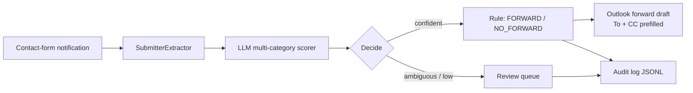

# Email Inbox Routing

**AI-assisted shared-inbox classification and routing** — a workplace automation case study.

Shared contact-form inboxes often look the same every day: someone reads the message, guesses the right owner, and forwards it by hand. This project turns that into a repeatable pipeline: **extract → LLM classify → decide → prefill a native Outlook forward** (or batch-process local files), while keeping a human in the loop for send.

> Demo mailboxes use fictional `example.com` addresses and a generic “DemoCo” company. Categories and recipients are **illustrative** — swap them for your own taxonomy.

**Repo:** https://github.com/ZEYICHEN-md/email-inbox-routing

---

## The problem

| Manual inbox work | What goes wrong |
|-------------------|-----------------|
| Read every contact-form notification | Slow when volume spikes |
| Decide which team owns it | Easy to misroute ambiguous “partnership” mail |
| Type To / CC by hand | Typos, missing shared CC, inconsistent handling |
| No trail of why it was routed | Hard to audit later |

## The approach

1. **Parse** the notification body (submitter + form message).
2. **Score** a small set of routing categories in one LLM call (OpenAI-compatible API).
3. **Decide** with a confidence threshold; ambiguous or low-confidence cases go to a review queue.
4. **Route** via rules: forward to To + mandatory CC, or no-forward with a guidance link.
5. **Prefill** an Outlook Classic forward draft (VBA → local Node) so a person still clicks Send.



## What you get in 30 seconds

```powershell
git clone https://github.com/ZEYICHEN-md/email-inbox-routing.git
cd email-inbox-routing
npm install
npm run demo
```

`npm run demo` prints a sample input + `classify:json` result **without an API key**.

Example routing decision (media inquiry → PR desk):

```json
{
  "decision": {
    "kind": "SingleCategory",
    "category": "PR_Media_International",
    "score": 0.91
  },
  "routing": {
    "action": "FORWARD",
    "outlookTo": "pr-media@example.com",
    "outlookCc": "inbox-cc@example.com"
  }
}
```

Full sample: [`docs/examples/classify-media-inquiry.json`](docs/examples/classify-media-inquiry.json).

Live classify (needs a key):

```powershell
copy .env.example .env
# set LLM_API_KEY=...
npm run classify -- --body-file fixtures/atra-media-inquiry.txt
```

---

## Demo taxonomy (8 categories)

Kept intentionally small so the story is easy to follow:

| Category | Behavior | Demo recipient |
|----------|----------|----------------|
| `IBU_Customer_Service` | FORWARD | `intl-support@example.com` |
| `Domestic_Complaint` | FORWARD | `domestic-support@…` |
| `Flight_Complaint` | FORWARD | `flight-complaints@example.com` |
| `PR_Media_International` | FORWARD | `pr-media@example.com` |
| `KOL` | FORWARD | `influencer-marketing@example.com` |
| `Business_Cooperation` | FORWARD | `partnerships@example.com` |
| `Partner_Business_Referral` | NO_FORWARD (+ portal link) | — |
| `Needs_Manual_Review` | review queue | — |

Carve-outs in code still handle common edge cases (e.g. overseas vs mainland flight complaints; KOL vs B2B “partnership” wording).

---

## Everyday workflows

| Goal | Command / action |
|------|------------------|
| Offline showcase | `npm run demo` |
| Live classify | `npm run classify -- --body-file fixtures/...` |
| JSON for automation / VBA | `npm run classify:json -- --body-file ... --out result.json` |
| Batch local mail | Drop `.eml` / `.txt` into `inbox/` → `npm run process:inbox` |
| Outlook one-click | Macros in [`outlook/`](outlook/README.md) → `ClassifyAndForwardSelected` |

The Outlook path is **human-in-the-loop**: the macro prefills recipients; you review and send.

---

## Quick start (live LLM)

**Requirements:** Node.js 20+, an OpenAI-compatible API key.

```powershell
git clone https://github.com/ZEYICHEN-md/email-inbox-routing.git
cd email-inbox-routing
copy .env.example .env
npm install
npm test
npm run classify -- --body-file fixtures/atra-media-inquiry.txt
```

```env
LLM_BASE_URL=https://api.openai.com
LLM_API_PATH=/v1/chat/completions
LLM_API_KEY=sk-...
LLM_MODEL=gpt-4o-mini
```

Works with OpenAI, Azure OpenAI, or any compatible gateway.

---

## Project layout

```
src/
  classifier/          LLM client + multi-category scorer + carve-outs
  submitterExtractor/  Parse form notifications
  router/              Forward / no-forward / review
  ruleSet/             Demo category → recipient mappings
  manualRouting/       Shared CLI + VBA classify-and-route
  graph/               Optional Microsoft Graph helpers
outlook/               VBA macros for Outlook Classic
fixtures/              Synthetic sample messages
docs/examples/         Sample classify:json output
tests/                 Unit + property + integration tests
```

Advanced / optional scripts: [`docs/optional-scripts.md`](docs/optional-scripts.md).

---

## Customize for your team

1. Edit `src/ruleSet/seedData.ts` — categories, behaviors, recipients.
2. Update `src/classifier/categoryGuidance.ts` — prompt descriptions.
3. Adjust `FORWARD_CC_RECIPIENT` in `src/router/index.ts` if you always CC a shared mailbox.
4. Point `EXPECTED_SENDER` / subject filters in `src/notificationFilter/` at your notification format.

Keep real addresses and internal runbooks out of public forks.

---

## Design notes

- **Native forward, not rewrite** — original body, subject, and attachments stay intact; the tool only chooses recipients.
- **Ambiguity is first-class** — competing categories go to review instead of a wrong mailbox.
- **Desktop bridge when cloud APIs are restricted** — Outlook VBA + local Node is a realistic pattern when Graph or IT policy blocks full automation.
- **Rules as data** — categories and recipients are versionable mappings, not buried only in prompt text.

---

## Disclaimer

This repository is a **portfolio / educational showcase**. Sample messages, category names, and `@example.com` recipients are fictional. Do not treat the included mappings as production configuration for any real organization.

## License

MIT — see [LICENSE](LICENSE).
